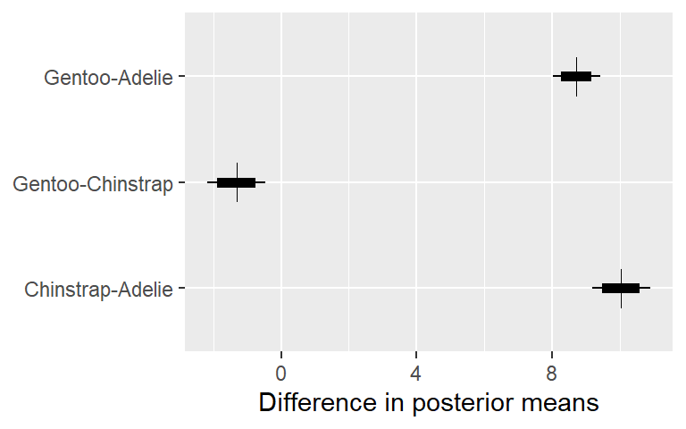

<!-- README.md is generated from README.Rmd. Please edit that file -->

# tjmisc

<!-- badges: start -->

[](https://github.com/tjmahr/tjmisc/actions)
<!-- badges: end -->

The goal of tjmisc is to gather miscellaneous helper functions, mostly
for use in [my dissertation](https://github.com/tjmahr/dissertation).

Apologies in advance. I think “misc” packages are kind of bad because
packages should be focused on specific problems: for example, my helper
packages for [working on
polynomials](https://github.com/tjmahr/polypoly), [printing
numbers](https://github.com/tjmahr/printy) or [tidying MCMC
samples](https://github.com/tjmahr/tristan). Having modular code
snapping together like Lego blocks is better than a grab-bag of
functions, it’s true, but using `library(helpers)` is much, much better
than using `source("helpers.R")`. So here we are… in the grab-bag.

## Installation

You can install the tjmisc from github with:

``` r
# install.packages("devtools")
devtools::install_github("tjmahr/tjmisc")
```

## Examples

### Sample groups of data

`sample_n_of()` is like dplyr’s `sample_n()` but it samples groups.

``` r
library(dplyr, warn.conflicts = FALSE)
library(tjmisc)
set.seed(11022017)

data <- tibble::tibble(
  day = 1:10 %>% rep(10) %>% sort(),
  id  = 1:10 %>% rep(10),
  block = letters[1:5] %>% rep(10) %>% sort() %>% rep(2),
  value = rnorm(100) %>% round(2))

# data from 3 days
sample_n_of(data, 3, day)
#> Warning: `data_frame()` was deprecated in tibble 1.1.0.
#> Please use `tibble()` instead.
#> # A tibble: 30 x 4
#>      day    id block value
#>    <int> <int> <chr> <dbl>
#>  1     1     1 a     -0.51
#>  2     1     2 a     -0.01
#>  3     1     3 a     -0.79
#>  4     1     4 a     -0.74
#>  5     1     5 a      0.72
#>  6     1     6 a     -1.17
#>  7     1     7 a      1.11
#>  8     1     8 a      1.38
#>  9     1     9 a     -0.89
#> 10     1    10 a     -0.06
#> # ... with 20 more rows

# data from 1 id
sample_n_of(data, 1, id)
#> # A tibble: 10 x 4
#>      day    id block value
#>    <int> <int> <chr> <dbl>
#>  1     1     4 a     -0.74
#>  2     2     4 b     -0.46
#>  3     3     4 c      1.99
#>  4     4     4 d     -0.7 
#>  5     5     4 e     -0.41
#>  6     6     4 a      0.84
#>  7     7     4 b     -0.01
#>  8     8     4 c     -1.49
#>  9     9     4 d     -0.59
#> 10    10     4 e     -1.86

# data from 2 block-id pairs
sample_n_of(data, 2, block, id)
#> # A tibble: 4 x 4
#>     day    id block value
#>   <int> <int> <chr> <dbl>
#> 1     3     8 c      0.06
#> 2     4     5 d     -0.69
#> 3     8     8 c      2.02
#> 4     9     5 d     -0.51
```

### Tidy quantiles

`tidy_quantile()` returns a dataframe with quantiles for a given
variable. I like to use it to select values for plotting model
predictions.

``` r
iris %>% 
  tidy_quantile(Petal.Length)
#> # A tibble: 5 x 2
#>   quantile Petal.Length
#>   <chr>           <dbl>
#> 1 10%              1.4 
#> 2 30%              1.7 
#> 3 50%              4.35
#> 4 70%              5   
#> 5 90%              5.8

iris %>% 
  group_by(Species) %>% 
  tidy_quantile(Petal.Length)
#> # A tibble: 15 x 3
#>    Species    quantile Petal.Length
#>    <fct>      <chr>           <dbl>
#>  1 setosa     10%              1.3 
#>  2 setosa     30%              1.4 
#>  3 setosa     50%              1.5 
#>  4 setosa     70%              1.5 
#>  5 setosa     90%              1.7 
#>  6 versicolor 10%              3.59
#>  7 versicolor 30%              4   
#>  8 versicolor 50%              4.35
#>  9 versicolor 70%              4.5 
#> 10 versicolor 90%              4.8 
#> 11 virginica  10%              4.9 
#> 12 virginica  30%              5.1 
#> 13 virginica  50%              5.55
#> 14 virginica  70%              5.8 
#> 15 virginica  90%              6.31
```

### Tidy correlations

`tidy_correlation()` calculates correlations between pairs of selected
dataframe columns. It accepts `dplyr::select()` selection semantics, and
it respects grouped dataframes.

``` r
tidy_correlation(iris, -Species)
#> # A tibble: 6 x 5
#>   column1      column2      estimate     n p.value
#>   <chr>        <chr>           <dbl> <dbl>   <dbl>
#> 1 Sepal.Width  Sepal.Length   -0.118   150   0.152
#> 2 Petal.Length Sepal.Length    0.872   150   0    
#> 3 Petal.Length Sepal.Width    -0.428   150   0    
#> 4 Petal.Width  Sepal.Length    0.818   150   0    
#> 5 Petal.Width  Sepal.Width    -0.366   150   0    
#> 6 Petal.Width  Petal.Length    0.963   150   0

iris %>%
  dplyr::group_by(Species) %>%
  tidy_correlation(dplyr::starts_with("Petal"))
#> # A tibble: 3 x 6
#>   Species    column1     column2      estimate     n p.value
#>   <fct>      <chr>       <chr>           <dbl> <dbl>   <dbl>
#> 1 setosa     Petal.Width Petal.Length    0.332    50  0.0186
#> 2 versicolor Petal.Width Petal.Length    0.787    50  0     
#> 3 virginica  Petal.Width Petal.Length    0.322    50  0.0225
```

### Pairwise comparisons

`compare_pairs()` compares all pairs of values among levels of a
categorical variable. Hmmm, that sounds confusing. Here’s an example. We
compute the difference in average score between each pair of workers.

``` r
to_compare <- nlme::Machines %>%
  group_by(Worker) %>%
  summarise(avg_score = mean(score)) %>%
  print()
#> # A tibble: 6 x 2
#>   Worker avg_score
#> * <ord>      <dbl>
#> 1 6           50.6
#> 2 2           58.0
#> 3 4           59.6
#> 4 1           60.9
#> 5 3           66.1
#> 6 5           62.7

to_compare %>%
  compare_pairs(Worker, avg_score) %>%
  rename(difference = value) %>%
  mutate_if(is.numeric, round, 1)
#> # A tibble: 15 x 2
#>    pair  difference
#>    <fct>      <dbl>
#>  1 1-6         10.3
#>  2 1-4          1.3
#>  3 1-2          2.9
#>  4 2-6          7.4
#>  5 3-6         15.5
#>  6 3-4          6.5
#>  7 3-2          8.1
#>  8 3-1          5.2
#>  9 4-6          9  
#> 10 4-2          1.6
#> 11 5-6         12.1
#> 12 5-4          3.1
#> 13 5-3         -3.4
#> 14 5-2          4.7
#> 15 5-1          1.8
```

### Et cetera

`ggpreview()` is like ggplot2’s `ggsave()` but it saves an image to a
temporary file and then opens it in the system viewer. If you’ve ever
found yourself in a loop of saving a plot, leaving RStudio to
doubleclick the file, sighing, going back to RStudio, tweaking the
height or width or plot theme, ever so slowly spiraling in on your
desired plot, then `ggpreview()` is for you.

`seq_along_rows()` saves a few keystrokes in for-loops that iterate over
dataframe rows.

``` r
cars %>% head(5) %>% seq_along_rows()
#> [1] 1 2 3 4 5
cars %>% head(0) %>% seq_along_rows()
#> integer(0)
```

`is_same_as_last` and `replace_if_same_as_last()` are helpers for
formatting tables. I use them to replace repeating values in a text
column with blanks.

``` r
mtcars %>% 
  tibble::rownames_to_column("name") %>% 
  slice(1:10) %>% 
  select(cyl, name, mpg) %>% 
  arrange(cyl, mpg) %>% 
  mutate_at(c("cyl"), replace_if_same_as_last, "") %>% 
  knitr::kable()
```

| cyl | name              |  mpg |
|:----|:------------------|-----:|
| 4   | Datsun 710        | 22.8 |
|     | Merc 230          | 22.8 |
|     | Merc 240D         | 24.4 |
| 6   | Valiant           | 18.1 |
|     | Merc 280          | 19.2 |
|     | Mazda RX4         | 21.0 |
|     | Mazda RX4 Wag     | 21.0 |
|     | Hornet 4 Drive    | 21.4 |
| 8   | Duster 360        | 14.3 |
|     | Hornet Sportabout | 18.7 |

`fct_add_counts()` adds counts to a factor’s labels.

``` r
# Create a factor with some random counts
set.seed(20190124)
random_iris <- iris %>% 
  dplyr::sample_n(250, replace = TRUE)

table(random_iris$Species)
#> 
#>     setosa versicolor  virginica 
#>         91         88         71

# Updated factors
random_iris$Species %>% levels()
#> [1] "setosa"     "versicolor" "virginica"
random_iris$Species %>% fct_add_counts() %>% levels()
#> [1] "setosa (91)"     "versicolor (88)" "virginica (71)"
```

You can tweak the format for the first label. I like to use this for
plotting by stating the unit next to the first count.

``` r
random_iris$Species %>% 
  fct_add_counts(first_fmt = "{levels} ({counts} flowers)") %>% 
  levels()
#> [1] "setosa (91 flowers)" "versicolor (88)"     "virginica (71)"
```

## More involved demos

These are things that I would have used in the demo above but cut and
moved down here to keep that overview succinct.

### Comparing pairs of values over a posterior distribution

I wrote `compare_pairs()` to compute posterior differences in Bayesian
models. For the sake of example, let’s fit a Bayesian model of average
sepal length for each species in `iris`. We could get these estimates
more directly using the default dummy-coding of factors, but let’s
ignore that for now.

``` r
library(rstanarm)
#> Loading required package: Rcpp
#> This is rstanarm version 2.21.1
#> - See https://mc-stan.org/rstanarm/articles/priors for changes to default priors!
#> - Default priors may change, so it's safest to specify priors, even if equivalent to the defaults.
#> - For execution on a local, multicore CPU with excess RAM we recommend calling
#>   options(mc.cores = parallel::detectCores())
m <- stan_glm(
  Sepal.Length ~ Species - 1,
  iris,
  family = gaussian)
```

Now, we have a posterior distribution of species means.

``` r
newdata <- data.frame(Species = unique(iris$Species))

p_means <- posterior_linpred(m, newdata = newdata) %>%
  as.data.frame() %>%
  tibble::as_tibble() %>%
  setNames(newdata$Species) %>%
  tibble::rowid_to_column("draw") %>%
  tidyr::gather(species, mean, -draw) %>%
  print()
#> # A tibble: 12,000 x 3
#>     draw species  mean
#>    <int> <chr>   <dbl>
#>  1     1 setosa   5.04
#>  2     2 setosa   4.96
#>  3     3 setosa   5.06
#>  4     4 setosa   4.95
#>  5     5 setosa   5.06
#>  6     6 setosa   4.96
#>  7     7 setosa   5.09
#>  8     8 setosa   5.05
#>  9     9 setosa   4.88
#> 10    10 setosa   4.86
#> # ... with 11,990 more rows
```

For each posterior sample, we can compute pairwise differences of means
with `compare_means()`.

``` r
pair_diffs <- compare_pairs(p_means, species, mean) %>%
  print()
#> # A tibble: 12,000 x 3
#>     draw pair              value
#>    <int> <fct>             <dbl>
#>  1     1 versicolor-setosa 0.919
#>  2     2 versicolor-setosa 1.00 
#>  3     3 versicolor-setosa 0.888
#>  4     4 versicolor-setosa 0.986
#>  5     5 versicolor-setosa 0.846
#>  6     6 versicolor-setosa 0.957
#>  7     7 versicolor-setosa 0.781
#>  8     8 versicolor-setosa 0.780
#>  9     9 versicolor-setosa 1.12 
#> 10    10 versicolor-setosa 1.13 
#> # ... with 11,990 more rows

library(ggplot2)

ggplot(pair_diffs) +
  aes(x = pair, y = value) +
  stat_summary(fun.data = median_hilow, geom = "linerange") +
  stat_summary(fun.data = median_hilow, fun.args = list(conf.int = .8),
               size = 2, geom = "linerange") +
  stat_summary(fun.y = median, size = 5, shape = 3, geom = "point") +
  labs(x = NULL, y = "Difference in posterior means") +
  coord_flip()
#> Warning: `fun.y` is deprecated. Use `fun` instead.
```

<!-- -->

…which should look like the effect ranges in the dummy-coded models.

``` r
m2 <- update(m, Sepal.Length ~ Species)
m3 <- update(m, Sepal.Length ~ Species, 
             data = iris %>% mutate(Species = forcats::fct_rev(Species)))
```

Give or take a few decimals of precision and give or take changes in
signs because of changes in who was subtracted from whom.

``` r
# setosa verus others
m2 %>% 
  posterior_interval(regex_pars = "Species") %>% 
  round(2)
#>                     5%  95%
#> Speciesversicolor 0.76 1.10
#> Speciesvirginica  1.41 1.75

# virginica versus others
m3 %>% 
  rstanarm::posterior_interval(regex_pars = "Species") %>% 
  round(2)
#>                      5%   95%
#> Speciesversicolor -0.82 -0.48
#> Speciessetosa     -1.75 -1.41

# differences from compare_pairs()
pair_diffs %>% 
  tidyr::spread(pair, value) %>% 
  select(-draw) %>% 
  as.matrix() %>% 
  posterior_interval() %>% 
  round(2)
#>                        5%  95%
#> versicolor-setosa    0.76 1.09
#> virginica-versicolor 0.48 0.82
#> virginica-setosa     1.41 1.75
```
