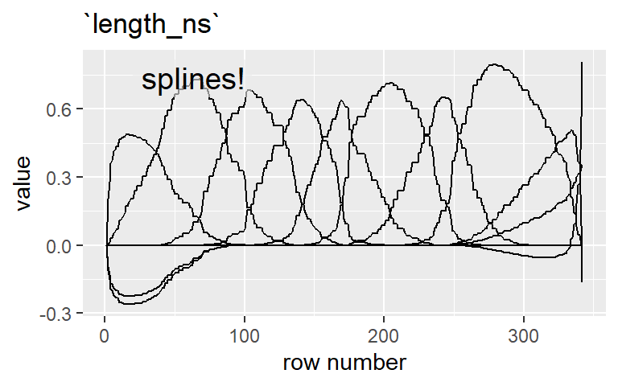

<!-- README.md is generated from README.Rmd. Please edit that file -->

# tjmisc

<!-- badges: start -->

[](https://github.com/tjmahr/tjmisc/actions)
<!-- badges: end -->

The goal of tjmisc is to gather miscellaneous helper functions, mostly
for use in [my dissertation](https://github.com/tjmahr/dissertation).

Apologies in advance. I think “misc” packages are kind of bad because
packages should be focused on specific problems: for example, my helper
packages for [working on
polynomials](https://github.com/tjmahr/polypoly), [printing
numbers](https://github.com/tjmahr/printy) or [tidying MCMC
samples](https://github.com/tjmahr/tristan). Having modular code
snapping together like Lego blocks is better than a grab-bag of
functions, it’s true, but using `library(helpers)` is much, much better
than using `source("helpers.R")`. So here we are… in the grab-bag.

## Installation

You can install the tjmisc from github with:

``` r
# install.packages("devtools")
devtools::install_github("tjmahr/tjmisc")
```

## Examples

### Sample groups of data

`sample_n_of()` is like dplyr’s `sample_n()` but it samples groups.

``` r
library(dplyr, warn.conflicts = FALSE)
library(tjmisc)
set.seed(11022017)

data <- tibble::tibble(
  day = 1:10 %>% rep(10) %>% sort(),
  id  = 1:10 %>% rep(10),
  block = letters[1:5] %>% rep(10) %>% sort() %>% rep(2),
  value = rnorm(100) %>% round(2)
)

# data from 3 days
sample_n_of(data, 3, day)
#> # A tibble: 30 x 4
#>      day    id block value
#>    <int> <int> <chr> <dbl>
#>  1     1     1 a     -0.51
#>  2     1     2 a     -0.01
#>  3     1     3 a     -0.79
#>  4     1     4 a     -0.74
#>  5     1     5 a      0.72
#>  6     1     6 a     -1.17
#>  7     1     7 a      1.11
#>  8     1     8 a      1.38
#>  9     1     9 a     -0.89
#> 10     1    10 a     -0.06
#> # ... with 20 more rows

# data from 1 id
sample_n_of(data, 1, id)
#> # A tibble: 10 x 4
#>      day    id block value
#>    <int> <int> <chr> <dbl>
#>  1     1     4 a     -0.74
#>  2     2     4 b     -0.46
#>  3     3     4 c      1.99
#>  4     4     4 d     -0.7 
#>  5     5     4 e     -0.41
#>  6     6     4 a      0.84
#>  7     7     4 b     -0.01
#>  8     8     4 c     -1.49
#>  9     9     4 d     -0.59
#> 10    10     4 e     -1.86

# data from 2 block-id pairs
sample_n_of(data, 2, block, id)
#> # A tibble: 4 x 4
#>     day    id block value
#>   <int> <int> <chr> <dbl>
#> 1     3     8 c      0.06
#> 2     4     5 d     -0.69
#> 3     8     8 c      2.02
#> 4     9     5 d     -0.51
```

### Tidy quantiles

`tidy_quantile()` returns a dataframe with quantiles for a given
variable. I like to use it to select values for plotting model
predictions.

``` r
penguins <- palmerpenguins::penguins

penguins %>% 
  tidy_quantile(bill_length_mm)
#> # A tibble: 5 x 2
#>   quantile bill_length_mm
#>   <chr>             <dbl>
#> 1 10%                36.6
#> 2 30%                40.2
#> 3 50%                44.4
#> 4 70%                47.4
#> 5 90%                50.8

penguins %>% 
  group_by(species) %>% 
  tidy_quantile(bill_length_mm)
#> # A tibble: 15 x 3
#>    species   quantile bill_length_mm
#>    <fct>     <chr>             <dbl>
#>  1 Adelie    10%                35.5
#>  2 Adelie    30%                37.3
#>  3 Adelie    50%                38.8
#>  4 Adelie    70%                40.3
#>  5 Adelie    90%                42.1
#>  6 Chinstrap 10%                45.2
#>  7 Chinstrap 30%                46.6
#>  8 Chinstrap 50%                49.6
#>  9 Chinstrap 70%                50.8
#> 10 Chinstrap 90%                52.1
#> 11 Gentoo    10%                43.5
#> 12 Gentoo    30%                45.6
#> 13 Gentoo    50%                47.3
#> 14 Gentoo    70%                49.1
#> 15 Gentoo    90%                50.8
```

### Tidy correlations

`tidy_correlation()` calculates correlations between pairs of selected
dataframe columns. It accepts `dplyr::select()` selection semantics, and
it respects grouped dataframes.

``` r
penguins %>% 
  tidy_correlation(bill_length_mm, bill_depth_mm, flipper_length_mm)
#> # A tibble: 3 x 5
#>   column1           column2        estimate     n p.value
#>   <chr>             <chr>             <dbl> <dbl>   <dbl>
#> 1 bill_depth_mm     bill_length_mm   -0.235   342       0
#> 2 flipper_length_mm bill_length_mm    0.656   342       0
#> 3 flipper_length_mm bill_depth_mm    -0.584   342       0

penguins %>%
  dplyr::group_by(species) %>%
  tidy_correlation(dplyr::ends_with("mm"))
#> # A tibble: 9 x 6
#>   species   column1           column2        estimate     n p.value
#>   <fct>     <chr>             <chr>             <dbl> <dbl>   <dbl>
#> 1 Adelie    bill_depth_mm     bill_length_mm    0.392   151  0     
#> 2 Adelie    flipper_length_mm bill_length_mm    0.326   151  0     
#> 3 Adelie    flipper_length_mm bill_depth_mm     0.308   151  0.0001
#> 4 Chinstrap bill_depth_mm     bill_length_mm    0.654    68  0     
#> 5 Chinstrap flipper_length_mm bill_length_mm    0.472    68  0     
#> 6 Chinstrap flipper_length_mm bill_depth_mm     0.580    68  0     
#> 7 Gentoo    bill_depth_mm     bill_length_mm    0.643   123  0     
#> 8 Gentoo    flipper_length_mm bill_length_mm    0.661   123  0     
#> 9 Gentoo    flipper_length_mm bill_depth_mm     0.707   123  0
```

### Pairwise comparisons

`compare_pairs()` compares all pairs of values among levels of a
categorical variable. Hmmm, that sounds confusing. Here’s an example. We
compute the difference in average score between each pair of workers.

``` r
to_compare <- nlme::Machines %>%
  group_by(Worker) %>%
  summarise(avg_score = mean(score)) %>%
  print()
#> # A tibble: 6 x 2
#>   Worker avg_score
#> * <ord>      <dbl>
#> 1 6           50.6
#> 2 2           58.0
#> 3 4           59.6
#> 4 1           60.9
#> 5 3           66.1
#> 6 5           62.7

to_compare %>%
  compare_pairs(Worker, avg_score) %>%
  rename(difference = value) %>%
  mutate(
    across(where(is.numeric), round, 1)
  )
#> # A tibble: 15 x 2
#>    pair  difference
#>    <fct>      <dbl>
#>  1 1-6         10.3
#>  2 1-4          1.3
#>  3 1-2          2.9
#>  4 2-6          7.4
#>  5 3-6         15.5
#>  6 3-4          6.5
#>  7 3-2          8.1
#>  8 3-1          5.2
#>  9 4-6          9  
#> 10 4-2          1.6
#> 11 5-6         12.1
#> 12 5-4          3.1
#> 13 5-3         -3.4
#> 14 5-2          4.7
#> 15 5-1          1.8
```

### Plotting a matrix

`ggmatplot()` plots the columns of a matrix as individual lines, much
like `matplot()` in base R.

Here we plot a spline basis matrix for penguin bill length. By default
it plots the columns with unique row number as the x-axis.

``` r
# Create a 10-column natural spline bases
sorted_lengths <- sort(penguins$bill_length_mm)
length_ns <- splines::ns(sorted_lengths, df = 10)
ggmatplot(length_ns)
```


Alternatively, you can supply a column number and make it the *x* axis.
In this example, we bind on the original data and use it as the *x*-axis
column. This makes the lines much smoother because the spline basis was
built on the bill lengths, not on row numbers.

``` r
ggmatplot(cbind(sorted_lengths, length_ns), x_axis_column = 1)
```


By default, duplicated rows are removed. We can choose to keep them. The
little flat steps along the curve are the repeated rows. We can also
change the number of colors to use.

``` r
ggmatplot(
  length_ns, 
  unique_rows = FALSE, 
  n_colors = 1
)
```



### Et cetera

`ggpreview()` is like ggplot2’s `ggsave()` but it saves an image to a
temporary file and then opens it in the system viewer. If you’ve ever
found yourself in a loop of saving a plot, leaving RStudio to
doubleclick the file, sighing, going back to RStudio, tweaking the
height or width or plot theme, ever so slowly spiraling in on your
desired plot, then `ggpreview()` is for you.

`seq_along_rows()` saves a few keystrokes in for-loops that iterate over
dataframe rows.

``` r
cars %>% head(5) %>% seq_along_rows()
#> [1] 1 2 3 4 5
cars %>% head(0) %>% seq_along_rows()
#> integer(0)
```

`is_same_as_last` and `replace_if_same_as_last()` are helpers for
formatting tables. I use them to replace repeating values in a text
column with blanks.

``` r
mtcars %>% 
  tibble::rownames_to_column("name") %>% 
  slice(1:10) %>% 
  select(cyl, name, mpg) %>% 
  arrange(cyl, mpg) %>% 
  mutate_at(c("cyl"), replace_if_same_as_last, "") %>% 
  knitr::kable()
```

| cyl | name              |  mpg |
|:----|:------------------|-----:|
| 4   | Datsun 710        | 22.8 |
|     | Merc 230          | 22.8 |
|     | Merc 240D         | 24.4 |
| 6   | Valiant           | 18.1 |
|     | Merc 280          | 19.2 |
|     | Mazda RX4         | 21.0 |
|     | Mazda RX4 Wag     | 21.0 |
|     | Hornet 4 Drive    | 21.4 |
| 8   | Duster 360        | 14.3 |
|     | Hornet Sportabout | 18.7 |

`fct_add_counts()` adds counts to a factor’s labels.

``` r
# Create a factor with some random counts
set.seed(20190124)
random_penguins <- penguins %>% 
  dplyr::sample_n(250, replace = TRUE)

table(random_penguins$species)
#> 
#>    Adelie Chinstrap    Gentoo 
#>       108        41       101

# Updated factors
random_penguins$species %>% levels()
#> [1] "Adelie"    "Chinstrap" "Gentoo"
random_penguins$species %>% fct_add_counts() %>% levels()
#> [1] "Adelie (108)"   "Chinstrap (41)" "Gentoo (101)"
```

You can tweak the format for the first label. I like to use this for
plotting by stating the unit next to the first count.

``` r
random_penguins$species %>% 
  fct_add_counts(first_fmt = "{levels} ({counts} penguins)") %>% 
  levels()
#> [1] "Adelie (108 penguins)" "Chinstrap (41)"        "Gentoo (101)"
```

## More involved demos

These are things that I would have used in the demo above but cut and
moved down here to keep that overview succinct.

### Comparing pairs of values over a posterior distribution

I wrote `compare_pairs()` to compute posterior differences in Bayesian
models. For the sake of example, let’s fit a Bayesian model of average
bill length for each species in `penguins`. We could get these estimates
more directly using the default dummy-coding of factors, but let’s
ignore that for now.

``` r
library(rstanarm)
#> Loading required package: Rcpp
#> This is rstanarm version 2.21.1
#> - See https://mc-stan.org/rstanarm/articles/priors for changes to default priors!
#> - Default priors may change, so it's safest to specify priors, even if equivalent to the defaults.
#> - For execution on a local, multicore CPU with excess RAM we recommend calling
#>   options(mc.cores = parallel::detectCores())
m <- stan_glm(
  bill_length_mm ~ species - 1,
  penguins,
  family = gaussian
)
```

Now, we have a posterior distribution of species means.

``` r
newdata <- data.frame(species = unique(penguins$species))

p_means <- posterior_linpred(m, newdata = newdata) %>%
  as.data.frame() %>%
  tibble::as_tibble() %>%
  setNames(newdata$species) %>%
  tibble::rowid_to_column("draw") %>%
  tidyr::gather(species, mean, -draw) %>%
  print()
#> # A tibble: 12,000 x 3
#>     draw species  mean
#>    <int> <chr>   <dbl>
#>  1     1 Adelie   39.1
#>  2     2 Adelie   38.9
#>  3     3 Adelie   38.7
#>  4     4 Adelie   38.4
#>  5     5 Adelie   39.2
#>  6     6 Adelie   38.4
#>  7     7 Adelie   38.9
#>  8     8 Adelie   38.7
#>  9     9 Adelie   38.8
#> 10    10 Adelie   38.8
#> # ... with 11,990 more rows
```

For each posterior sample, we can compute pairwise differences of means
with `compare_means()`.

``` r
pair_diffs <- compare_pairs(p_means, species, mean) %>%
  print()
#> # A tibble: 12,000 x 3
#>     draw pair             value
#>    <int> <fct>            <dbl>
#>  1     1 Chinstrap-Adelie  9.25
#>  2     2 Chinstrap-Adelie  9.97
#>  3     3 Chinstrap-Adelie 10.3 
#>  4     4 Chinstrap-Adelie 10.5 
#>  5     5 Chinstrap-Adelie  9.32
#>  6     6 Chinstrap-Adelie 10.5 
#>  7     7 Chinstrap-Adelie  9.77
#>  8     8 Chinstrap-Adelie 10.3 
#>  9     9 Chinstrap-Adelie  9.12
#> 10    10 Chinstrap-Adelie 11.0 
#> # ... with 11,990 more rows

library(ggplot2)

ggplot(pair_diffs) +
  aes(x = pair, y = value) +
  stat_summary(fun.data = median_hilow, geom = "linerange") +
  stat_summary(fun.data = median_hilow, fun.args = list(conf.int = .8),
               size = 2, geom = "linerange") +
  stat_summary(fun.y = median, size = 5, shape = 3, geom = "point") +
  labs(x = NULL, y = "Difference in posterior means") +
  coord_flip()
#> Warning: `fun.y` is deprecated. Use `fun` instead.
```


…which should look like the effect ranges in the dummy-coded models.

``` r
m2 <- update(m, bill_length_mm ~ species)
m3 <- update(
  m, 
  bill_length_mm ~ species, 
  data = penguins %>% mutate(species = forcats::fct_rev(species))
)
```

Give or take a few decimals of precision and give or take changes in
signs because of changes in who was subtracted from whom.

``` r
# Adelie versus others
m2 %>% 
  posterior_interval(regex_pars = "species") %>% 
  round(2)
#>                    5%   95%
#> speciesChinstrap 9.32 10.76
#> speciesGentoo    8.12  9.30

# Gentoo versus others
m3 %>% 
  rstanarm::posterior_interval(regex_pars = "species") %>% 
  round(2)
#>                     5%   95%
#> speciesChinstrap  0.59  2.07
#> speciesAdelie    -9.31 -8.12

# differences from compare_pairs()
pair_diffs %>% 
  tidyr::spread(pair, value) %>% 
  select(-draw) %>% 
  as.matrix() %>% 
  posterior_interval() %>% 
  round(2)
#>                     5%   95%
#> Chinstrap-Adelie  9.31 10.75
#> Gentoo-Chinstrap -2.04 -0.59
#> Gentoo-Adelie     8.15  9.29
```
